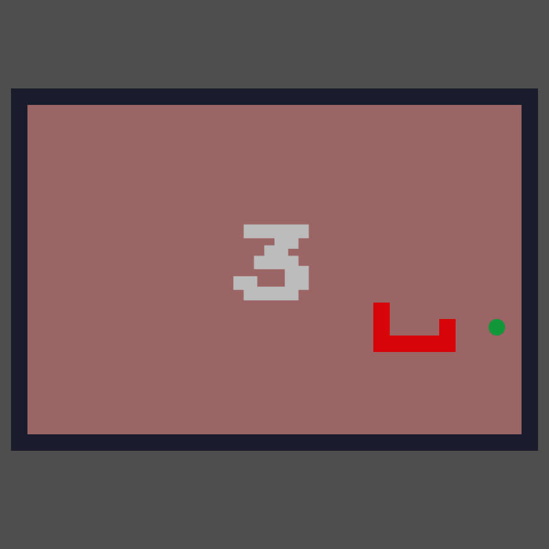

  

<h3 align="center">Snake-Game</h3>

---

 As part of the second training project, a simple snake game.
      

## 📝 Table of Contents

- [About](#about)
- [Usage](#usage)
<!-- - [Built Using](#built_using)
- [TODO](../TODO.md)
- [Contributing](../CONTRIBUTING.md) 
- [Authors](#authors)-->
- [Acknowledgments](#acknowledgement)

## 🧐 About 

Write about 1-2 paragraphs describing the purpose of your project.

## 🎈 Usage 

Add notes about how to use the system.

## 🎉 Acknowledgements 

- Hat tip to anyone whose code was used
- Inspiration
- References
